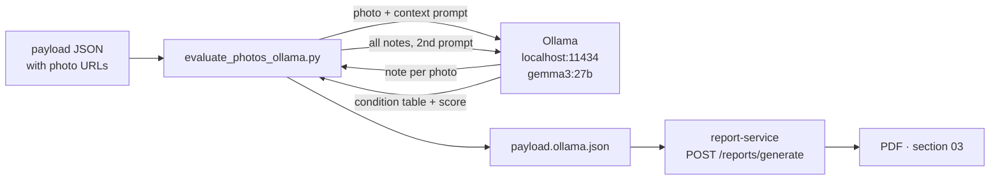

# Ollama photo-evaluation workflow

Local, **zero-cost** LLM pipeline that turns raw listing photos into the
buyer-facing content of report section 03: per-photo notes, the condition
table, and the **renovation score** (0–100 hero). Everything runs on the Mac —
no cloud APIs, no per-token billing, nothing leaves the machine (the
long-standing no-cloud-AI rule for the Estima runtime).

> [!info] One-line usage
> ```bash
> python3 scripts/evaluate_photos_ollama.py payload.json            # sk
> python3 scripts/evaluate_photos_ollama.py payload.json --lang cs  # estimacz
> ```

## How it works



1. **Per-photo pass** — each photo (from `vision_analysis.image_metrics[].url`)
   is downloaded (SSRF-guarded: public hosts only, redirects re-validated,
   25 MB cap), base64-encoded and sent to the model with a *listing context*
   block (title, dispozícia, m², lokalita + `property.description`
   auto-included, capped at 600 chars). Output is schema-forced JSON → one
   factual note per photo.
2. **Assembly pass** — all notes go back in one prompt → condition `items`
   (Podlahy, Kuchyňa, …), `summary`, `overall_score` 0–100, `overall_label`,
   and the score drivers (`score_positives` / `score_negatives`).
3. **Render** — the enriched JSON goes through report-service unchanged.
   The service never talks to Ollama; rendering stays deterministic and
   deployable on the GPU-less VPS.

## Model choice (A/B, 2026-08-12)

13-photo Košice/Odborárska gallery, same prompts, M5 Pro 48 GB:

| | gemma3:27b (default) | gemma3:12b |
|---|---|---|
| Wall time (13 photos + assembly) | **4 min 50 s** | **1 min 12 s** |
| Slovak grammar | clean | case/gender errors ("s rohovou sprchovacím kútom"), misspellings |
| Hallucination | none observed | "masážny panel"; context leaked into notes |
| Verdict | **production output** | drafts/smoke-tests only |

Both installed via `ollama pull gemma3:27b` (17 GB) / `gemma3:12b` (8.1 GB).
Ollama unloads models after ~5 min idle → zero footprint when not in use.

## Prompt design decisions

- **Staging detection is two-tier.** Per-photo prompts flag virtual staging
  only on concrete render evidence (unreal shadows/reflections, perfect
  textures, perspective mismatch) — modern furniture alone is *not* staging.
  The assembly prompt adds the reliable gallery-level tell: *the same room
  appearing both empty and furnished* ⇒ staged renders. (One-tier variants
  either over-flagged real bathrooms or missed staging entirely.)
- **Score rubric is anchored** (100 = complete new renovation, 50 = partly
  renovated/maintained original, 0 = derelict) and explicitly scores the
  *property*, not the photos.
- **Descriptive text only.** No prices, no value estimates — the semantic
  content is upstream-authored payload data (`condition_assessment`), never
  derived from pixel metrics; the guardrail test in `tests/test_estima_style.py`
  enforces that boundary.

## CLI reference

| Flag | Meaning |
|---|---|
| `payloads…` | one or more payload JSONs — batch runs write one `.ollama.json` each |
| `--lang sk\|cs` | prompt/string pack; must match the target report language |
| `--model` | default `gemma3:27b` |
| `--context "…"` | listing text override (default: payload's `property.description`) |
| `--condition-only` | rebuild the assessment from existing notes (one model call, ~30 s) |
| `--in-place` / `--out` | write destination (`--out` single-payload only) |

Overnight batch: `python3 scripts/evaluate_photos_ollama.py exports/*.json`
(~1–2 min per property on 27b).

## Deployment state

- [x] Report-service side (template hero + meters + drivers) — pushed
- [x] VPS runbook delivered (report-service on `127.0.0.1:8090`,
      `REPORT_SERVICE_URL` wiring for SK + CZ read-apis)
- [x] Backend handover spec — [[backend-condition-assessment-spec]]
- [ ] Backends actually sending `condition_assessment` (estima-sk-backend /
      estima-backend; CZ also needs its local commits pushed)
- [ ] Live showcase parity on estima.sk /analyzy (current showcase property:
      Košice/Ťahanovce id 360 — `samples/sample_kosice_tahanovce.json`)

## Related

- Script: `scripts/evaluate_photos_ollama.py`
- Samples: `samples/sample_kosice_odborarska.ollama.json` (staged listing,
  27b output), `samples/sample_kosice_tahanovce.json` (real-photo showcase)
- Spec: [[backend-condition-assessment-spec]]
- Template: `app/templates/estima/base.html` (section 03)
