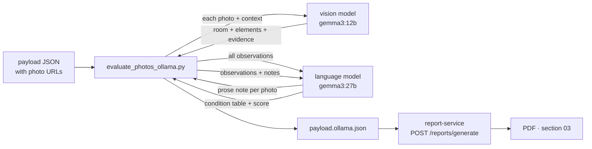

# Ollama photo-evaluation workflow

Local, **zero-cost** LLM pipeline that turns raw listing photos into the
buyer-facing content of report section 03: per-photo notes, the condition
table, and the **renovation score** (0–100 hero). Everything runs on the Mac —
no cloud APIs, no per-token billing, nothing leaves the machine (the
long-standing no-cloud-AI rule for the Estima runtime).

> [!info] One-line usage
> ```bash
> python3 scripts/evaluate_photos_ollama.py payload.json            # sk
> python3 scripts/evaluate_photos_ollama.py payload.json --lang cs  # estimacz
> ```

## How it works



1. **Per-photo pass** — each photo (from `vision_analysis.image_metrics[].url`)
   is downloaded (SSRF-guarded: public hosts only, redirects re-validated,
   25 MB cap), base64-encoded and sent to the model with a *listing context*
   block (title, dispozícia, m², lokalita + `property.description`
   auto-included, capped at 600 chars). Output is a **structured extraction**
   (schema-forced JSON): `room`, per-element states (`floors`/`walls`/
   `windows`/`heating`/`doors`, null unless clearly visible), buyer-relevant
   `features` and `staging_signs`. Each element carries an `evidence` string
   locating it in the frame. **Elements are a list, not fixed nullable keys** —
   required-but-nullable fields pressure the model into confabulating, which is
   exactly how "panelový radiátor" appeared in rooms that have none.
2. **Note composition** — one text-only call turns all observations into the
   per-photo prose notes (subjective adjectives banned by prompt). Done by the
   language model, so the grounded-but-Czech-leaking vision output never
   reaches the report.
3. **Assembly pass** — the full element-level evidence (not just the prose
   notes) goes back in one prompt → condition `items`, `summary`,
   `overall_score` 0–100, `overall_label`, and the score drivers
   (`score_positives` / `score_negatives`). The prompt pins the room count to
   the layout (repeat shots ≠ extra rooms) and owns the gallery-level staging
   tell (same room empty + furnished ⇒ renders).
4. **Render** — the enriched JSON goes through report-service unchanged.
   The service never talks to Ollama; rendering stays deterministic and
   deployable on the GPU-less VPS.

## Model choice — two models, split by job

The pipeline deliberately uses **two** models, because no single local model is
good at both jobs:

| | extraction (per photo) | prose + assembly |
|---|---|---|
| **default** | `gemma3:12b` (`--vision-model`) | `gemma3:27b` (`--model`) |
| why | omits what it cannot see | clean Slovak/Czech |

### Grounding benchmark (2026-08-12)

Absence detection is the discriminator. Control set: Ťahanovce photos 2 and 7
(**no radiator in frame**) and photo 4 (**old sectional radiator**, verified by
cropping the original at full resolution).

| model | controls passed | heating claimed across 12 photos | notes |
|---|---|---|---|
| gemma3:27b | 0 / 3 | **12 / 12** | canned "panelový radiátor @ pod oknom vľavo" everywhere, even with a required `evidence` field |
| qwen2.5vl:32b | **3 / 3** | 5 / 12 | best grounding (named the sectional radiator correctly) but mixes Czech into Slovak, mislabels living rooms as bedrooms, calls every floor "parketová" |
| **gemma3:12b** | **3 / 3** | **2 / 12** | correct room labels, caught "radiátor rebrového typu"; prose too weak to use directly → 27b composes |

Ground truth matters here: those radiators are **old sectional units**, i.e. a
renovation *cost*. The 27b-only pipeline reported "Panelové radiátory
udržiavané" as a score **positive** — wrong type, wrong direction, on the
public showcase listing. That single finding is why the split exists.

### Timing (12-photo gallery, M5 Pro 48 GB)

| config | wall time |
|---|---|
| 12b extract + 27b compose/assemble (**default**) | **4 min** |
| qwen2.5vl:32b extract + 27b | 8 min |
| 27b for everything (old) | 5 min, and ungrounded |

Installed: `gemma3:27b` (17 GB), `gemma3:12b` (8.1 GB), `qwen2.5vl:32b` (21 GB).
Ollama unloads after ~5 min idle → zero footprint when not in use.

> [!warning] Known remaining weaknesses
> - **Entrance doors**: the prompt now permits a "bezpečnostné vstupné dvere"
>   claim only in an entry/hallway shot with real evidence (security hardware,
>   multipoint lock, intercom/fuse box). Odborárska went 4 false claims → 0
>   (only the true hallway, photo 13). Ťahanovce still produces 2 false claims
>   out of 12, and they reach the score positives. Not solved, just reduced.
> - **Radiator type** (panel vs sectional) is unreliable in *both* directions —
>   Odborárska's genuinely new panel radiators get read as "pôvodný stav".
>   Presence detection is now sound; type is not.
>
> Rule of thumb: the pipeline is trustworthy about *what is in the frame*,
> and still shaky about *what kind of thing it is*.

## Prompt design decisions

- **Structured extraction beats prose notes — but only with a grounded
  extractor.** The scorer never sees pixels, only what the per-photo pass
  captured, so a single 25-word note dropped exactly the buyer-relevant
  evidence (radiator type, raw door jambs, water hookups). Itemizing recovered
  it: on Odborárska the unfinished bathroom/hallway are now called out instead
  of "vo výbornom stave". The catch: itemizing *also* multiplies confabulation
  if the extractor answers about things it cannot see — hence the model split
  and the list-shaped `elements` schema.
- **Staging detection is two-tier.** Per-photo prompts flag virtual staging
  only on concrete render evidence (unreal shadows/reflections, perfect
  textures, perspective mismatch) — modern furniture alone is *not* staging.
  The assembly prompt adds the reliable gallery-level tell: *the same room
  appearing both empty and furnished* ⇒ staged renders. (One-tier variants
  either over-flagged real bathrooms or missed staging entirely.)
- **Room labels are layout-constrained** — the assembly prompt pins the room
  count to the dispozícia so eight shots of one obývačka don't become eight
  rooms; the per-photo prompt teaches the kitchen-corner tell (water hookup +
  counter-height outlets) for unfitted kitchens.
- **Score rubric is anchored** (100 = complete new renovation, 50 = partly
  renovated/maintained original, 0 = derelict) and explicitly scores the
  *property*, not the photos.
- **Deterministic decoding** (`temperature 0`, fixed seed) — 0.2 gave a ±5
  score drift on identical input.
- **Descriptive text only.** No prices, no value estimates — the semantic
  content is upstream-authored payload data (`condition_assessment`), never
  derived from pixel metrics; the guardrail test in `tests/test_estima_style.py`
  enforces that boundary.

## CLI reference

| Flag | Meaning |
|---|---|
| `payloads…` | one or more payload JSONs — batch runs write one `.ollama.json` each |
| `--lang sk\|cs` | prompt/string pack; must match the target report language |
| `--model` | language model for prose + assessment (default `gemma3:27b`) |
| `--vision-model` | per-photo extraction (default `gemma3:12b`) |
| `--context "…"` | listing text override (default: payload's `property.description`) |
| `--condition-only` | rebuild the assessment from existing notes (one model call, ~30 s) |
| `--in-place` / `--out` | write destination (`--out` single-payload only) |

Overnight batch: `python3 scripts/evaluate_photos_ollama.py exports/*.json`
(~4 min per 12-photo property with the default pair).

## Deployment state

- [x] Report-service side (template hero + meters + drivers) — pushed
- [x] VPS runbook delivered (report-service on `127.0.0.1:8090`,
      `REPORT_SERVICE_URL` wiring for SK + CZ read-apis)
- [x] Backend handover spec — [[backend-condition-assessment-spec]]
- [ ] Backends actually sending `condition_assessment` (estima-sk-backend /
      estima-backend; CZ also needs its local commits pushed)
- [ ] Live showcase parity on estima.sk /analyzy (current showcase property:
      Košice/Ťahanovce id 360 — `samples/sample_kosice_tahanovce.json`)

## Related

- Script: `scripts/evaluate_photos_ollama.py`
- Samples: `samples/sample_kosice_odborarska.ollama.json` (staged listing,
  27b output), `samples/sample_kosice_tahanovce.json` (real-photo showcase)
- Spec: [[backend-condition-assessment-spec]]
- Template: `app/templates/estima/base.html` (section 03)
